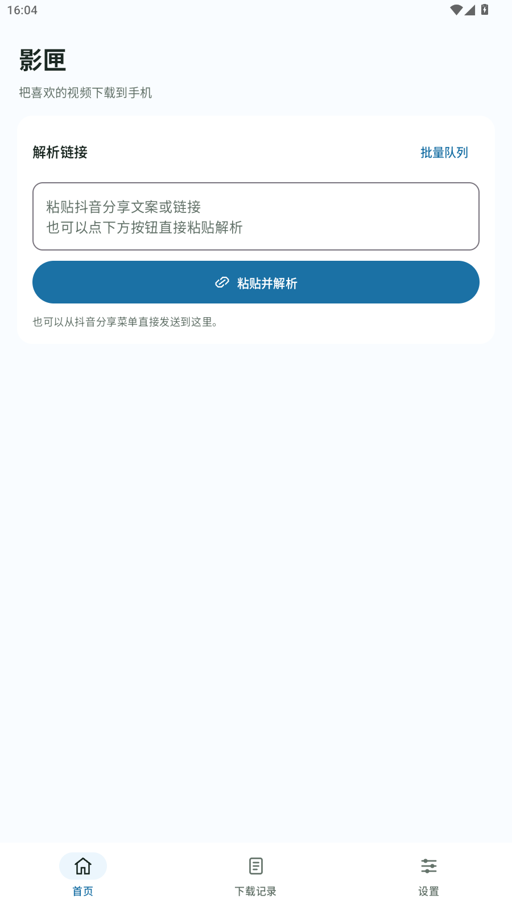
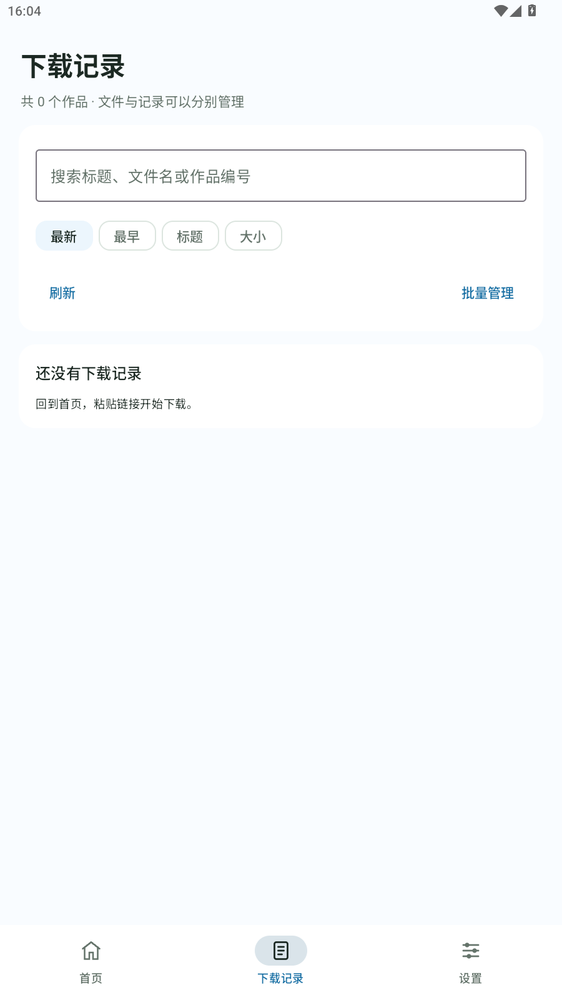

<div align="center">
  
  <h1>影匣</h1>
  <p><strong>把喜欢的视频下载到手机。</strong></p>
  <p>简洁的 Android 抖音视频与图集保存工具</p>
  <p><b>1.0.0 第一版</b> · Android 10 及以上 · Jetpack Compose</p>
  <p>
    <a href="https://github.com/fanyinmo/yingxia/releases">下载安装</a> ·
    <a href="docs/INSTALL.md">使用说明</a> ·
    <a href="docs/BUILD.md">构建项目</a> ·
    <a href="docs/VALIDATION.md">验证记录</a>
  </p>
</div>

## 页面预览

<table>
  <tr>
    <th align="center">首页</th>
    <th align="center">下载记录</th>
    <th align="center">设置</th>
  </tr>
  <tr>
    <td align="center"></td>
    <td align="center"></td>
    <td align="center"></td>
  </tr>
</table>

图片来自 MuMu 模拟器中的实际 App 页面，展示默认天蓝主题。

## 可以做什么

- **保存视频与图集**：粘贴分享文案或链接，解析、预览并保存；图集可保存原图，读取到可用 BGM 后可在手机上合成 MP4。
- **保持首页清爽**：一个按钮完成粘贴解析，输入框一键清空，旧解析结果随输入变化一起清除。
- **管理下载**：独立下载记录、搜索排序、批量队列、重复下载提示，以及自定义文件名和保存文件夹。
- **选择喜欢的颜色**：天蓝主题、浅色与深色模式、自选调色盘，选择后即时生效。
- **让背景融入页面**：导入图片，调整位置、裁切、虚化与暗度；板块不透明度支持 0–100%，文字保护可独立调节。

解析、下载与图集视频合成都在手机执行，不调用第三方解析网站或远程合成服务。下载和合成时使用前台服务显示进度。

## 开始使用

1. 在 [Releases](https://github.com/fanyinmo/yingxia/releases) 下载 APK，安装后打开影匣。
2. 在抖音复制作品分享链接，回到首页点击“粘贴并解析”。
3. 解析完成后选择保存视频、保存图片，或在有可用 BGM 时合成图集视频。

保存文件夹、主题和背景都在“设置”中调整。完整操作见 [安装与使用](docs/INSTALL.md)。

## 从源码构建

使用 **JDK 17、Android SDK 35**，在 Android Studio 中打开项目并同步。Windows 也可在仓库根目录执行：

```powershell
./scripts/build.ps1 -Validate
node --test parser-lab/browser-script.test.cjs parser-lab/public-page-script.test.cjs
```

脚本会验证并生成 `outputs/apk/yingxia-1.0.0.apk`。Linux/macOS 可使用仓库自带的 Gradle Wrapper；环境配置与运行测试见 [构建说明](docs/BUILD.md)。

## 解析范围

影匣读取平台提供的公开作品数据。页面未提供数据、作品失效或接口拒绝访问时，解析可能失败；不会自动登录或处理验证码。媒体是否带水印取决于实际来源。

图集 BGM 需要页面提供可用音频地址，无法保证每条作品都能读取；没有可用 BGM 时仍可保存原图。直播、私密与付费内容不在支持范围。请使用你有权保存的内容。

队列下一项解析需要返回 App；进程被系统终止后可重新解析重试，目前没有断点续传。

---

[验证记录](docs/VALIDATION.md) · [图标与品牌资源](docs/branding/README.md) · [发布与维护](docs/GITHUB.md)
