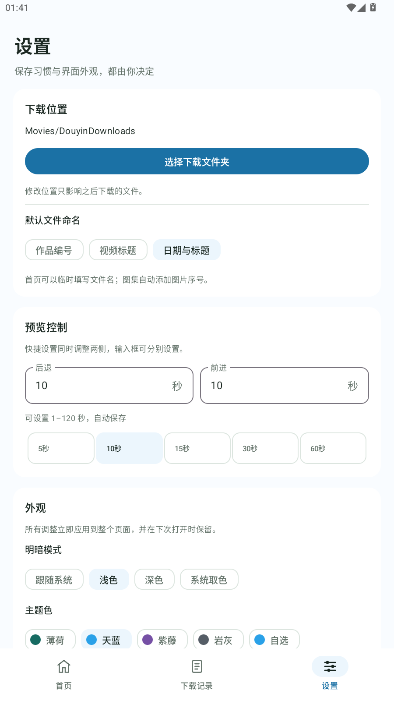

# 影匣 1.0.0 验证记录

日期：2026-10-03。包名 `com.local.douyinsaver`，versionCode 10、min SDK 29、target SDK 35。本次产物是沿用原开发签名的普通 debug APK。

## 名称、图标与主题

采用 A 方案的名称“影匣”和匣子/播放图形，图标配色改为天蓝渐变。桌面名称、首页标题、下载通知和关于页面使用统一名称。新安装默认主题为“天蓝”（`#2AA1E8`）；覆盖安装保留用户已经选择的主题、自选颜色和背景设置。

图标使用 Android 原生矢量和自适应图标资源，标志位于安全区域内；Android 13 及以上另有单色图标。播放三角和盖子间隙为真正的透明区域，已检查透明通道。源文件和预览见 [品牌说明](branding/README.md)。

调色盘保留二维饱和度/亮度面板、色相条、当前色预览和常用色，不显示颜色编号或编号输入框。

发布展示截图使用 MuMu 中的天蓝浅色主题，不包含用户照片。不同明暗模式会调整主题显示色以保持对比度。

## 自动检查

| 检查 | 结果 |
| --- | --- |
| Kotlin 单元测试 | 57 项通过，0 失败/错误/跳过 |
| JavaScript 解析回归 | 42 项通过 |
| Android Lint | 0 错误，42 警告 |
| Gradle 构建 | 普通 APK 和独立测试 APK 构建成功 |
| APK 验证 | 签名校验通过；普通包不含 instrumentation、测试 Activity 或图集测试素材 |
| MuMu 界面运行测试 | 4 项通过：首页交互 2 项、调色盘 2 项 |

首页测试验证清空输入后的结果联动和解析操作，使用测试素材。调色盘测试验证真实拖动和选点、白黑边缘恢复彩色、没有编号编辑框，以及独立偏好中的颜色持久化和旧值兼容。测试偏好独立于用户外观设置。

## 覆盖安装与实际界面

MuMu Android 15/API 35 上覆盖安装 1.0.0 成功。包名和签名保持一致，versionCode 从 9 增加至 10。覆盖安装前后，以及界面测试后，外观、保存位置和下载任务三个现有偏好文件的内容哈希一致；未清除应用数据。

实际首页显示“影匣”和“把喜欢的视频下载到手机”，设置中显示“天蓝”选项，关于页面显示“影匣 1.0.0”。旧自选颜色、测试背景图片和 0% 板块透明度设置仍保留。此次模拟器没有已有下载历史文件，因此未以已有历史记录验证覆盖安装。

独立测试 APK 已移除，临时旋转设置已恢复，下载服务已结束，主应用保留安装。本次没有接 USB 真机，也未重跑真实视频或图集下载。此前提供的图集在 MuMu 返回空数据/HTTP 403，实际图集 BGM 下载仍需手机复测。

## 最终 APK

- 本地文件：`outputs/apk/yingxia-1.0.0.apk`
- 大小：35,513,884 字节
- SHA-256：`3c424ea8d581bd953a13630b6a93ddca19f74a1325f27d3b420b135e890c76d3`
- 签名证书 SHA-256：`25710e8795821f8ac24872b626641737c54f16b56b74f6a3b2d38808b3ec0a53`

签名与此前安装包一致，可覆盖安装。源码、测试、构建脚本、最终图标和本记录保留；旧 APK、备选图标、构建缓存、临时文件和原始日志清理。SDK、JDK 和 Gradle 位于项目外的本机缓存，本地 APK 由 Git 忽略。
